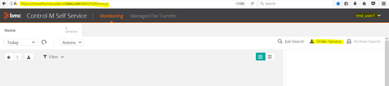

## Folder Structure (Physical Layout)

To provide consistency for job groupings across teams, each team will have a top-level SMART folder, and four matching sub-folders:

**SMART Folder:** `<Team>` - Team or Dept (e.g., AI, Oracle, SQLServer, Sysadmin)

**Subfolders:**
- **Backups** - Folder for all backups and backup-related jobs.
- **Maintenance** - Folder for all maintenance jobs related to the health of a database or server.
- **SelfService** - Folder for all SelfService folders and jobs. Anything in this folder should also have an "order" job scheduled in the SelfService Top-Level folder.
- **Utility** - Folder for utility jobs not related to database or server health (e.g., reports).


**Exception:**

The **SelfService** Top-Level Folder is used to store jobs that “order” other self-service jobs (e.g., *ctmorder* command).

- Note: This folder is NOT a SMART folder (indicated by no crown on the folder).


## Folder Structure (Logical Layout)

A way to group jobs (across teams) by Application and Sub-Application:

- **Application** – This should match the Technical Service in ITSM and is case-sensitive.
  - For Assets with no Technical Service, a general Application should be used (e.g., SQL_Database_Hosting).
  - Examples of Technical Services:
    - EBIZ
    - Collaboration.bmc.com
    - Confluence
- **Sub-Application** – This indicates the environment, should be 2-3 characters, in UPPERCASE (and is case-sensitive).
  - Examples:
    - PRD
    - DEV
    - QA

Examples of Application and Sub-Application Grouping across Teams / Depts:


**Other notes about jobs, folders, application, and sub-application usage:**

- Use Application and Sub-Application at “job” level only (not at folder-level).
- Do not use spaces in names of folders or jobs.
- Use underscore ( _ ) instead of dash ( - ).

## How to Create a Job

1. Open Control-M to the Planning Domain.
2. Select the Top-Level SMART Folder for your team and click Open.

   

3. Check-Out the folder (if it’s not already checked out by someone else).
   - Two options to Check Out – the Workspace Toolbar or the Information message on the screen.

   

4. Create a new folder in the correct Sub-Folder path (e.g., Alteryx in the Backups sub-folder).
   - In the “New” toolbar window, drag and drop the Folder icon on the Backups sub-folder.

   

5. A “Folder#1” will appear. Using the Properties window on the right-hand side of the screen, rename Folder#1 to Alteryx (per our example), and tab to another field to complete the action.

   

6. If the folder already exists, just expand to the folder where the job needs to be created (e.g., Alteryx).

   

7. Decide what type of job is needed (OS, Database, File Watcher), then drag the correct job type from the “new” toolbar window and drop it onto the correct folder (e.g., create an “OS” job for Alteryx Backups).
   - Drag and drop the OS job type onto the Alteryx Folder.

   

8. Using the Properties window on the right-side of the screen, fill in details about the job:

   **General tab:**
   - Job Name
   - What (Script, Command, or Embedded Script)
   - File Path and File Name
   - Command (single-line of code)
   - Embedded Script (multiple-lines of code)
   - Host / Host Group
   - Run As
   - Application & Sub-Application

   

   **Scheduling tab:**
   - What days to run the job
   - What time to execute the job
   - **Note**: “new day” starts at 10 AM, which may impact how to schedule a job.

   

   **Prerequisites & Actions tab:**
   - If a dependency is needed or to manage job resources.
   - If a dependency is used or to take actions on a job (email, rerun, etc.).

9. When done creating the jobs and/or other updates needed, **Check In** the Workspace.
   - On the Workspace Toolbar, select **Check In**.

   

10. Confirm Check In.

    

11. If you get a Warning while Verifying the Check In, you should investigate which jobs are in Warning.

    

12. Click Cancel and then look at the Validation warnings at the bottom of the screen.

    

    

    These errors are due to jobs having a wrong hostname in the job definition.

13. Once you’ve confirmed that the errors are not related to the jobs you created, **Check In** again.
    - Click **Continue Check In**.

    

14. When complete, click on Done. Then close the Workspace window.

    

## Steps for Creating Orderable Self-Service Job with Parameter in Control-M

1. **Develop and test scripts from command line:**

   ```bash
   [nz@phx-netzqa-01 scripts] $cd /export/home/nz/admin/controlm/scripts
   [nz@phx-netzqa-01 scripts] $./mstr_read_permissions_sync.sh STGSUP
   ```

2. **Create new job for script created in Step 1:**

   Under Control-M Planning -> Netezza -> SelfService (Or Oracle/SelfService)

   - **Job Name:** NZQA_Gen_Permissions_Sync
   - **Schedule:** None (This is required for orderable self-service)
   - **Script folder:** /export/home/nz/admin/controlm/scripts
   - **Script:** mstr_read_permissions_sync.sh
   - **Server:** netezzaqa
   - **Run as:** nz

   **Note:** If you are using some parameters while ordering job, define it at job level for single job **OR** define at folder level if you have multiple jobs under folder which is to be ordered (no need to define PARM at job level if defined at folder level).

3. **Create new job under SelfService (Top Level Folder) to order job created in Step 2:**

   Control-M Planning -> SelfService folder (Top Level Folder) -> Create new jobs which will order single job or folder created in Step 2.

   e.g.

   - **Job Name:** Order_NZQA_Gen_Permissions_Sync
   - **Schedule:** None
   - **Control-M Server:** phxctmprd03
   - **Run As:** oracle
   - **What:** Command (This is important to enter following ctmorder command)

   **Command to order job/folder:**

   ```bash
   ctmorder -FOLDER Netezza/SelfService -NAME NZQA_Gen_Permissions_Sync -FORCE y -hold n -ODATE ODAT -INTO_FOLDER_ORDERID NEWT -variable %%#%%#PARM1 %%PARM1
   ```

   Define same number of parameters which are required to order self-service job (e.g., PARM1, PARM2 …).

   **Note:** Above command is to order single job “NZQA_Gen_Permissions_Sync” under folder “Netezza/SelfService”. If you want to order entire folder, use folder name for -NAME option.

   

4. **Create new service definition for job created in Step 3:**

   Under Control-M -> Tools -> Service definition

   **General:**
   - **Name:** Service_NZQA_Gen_Permissions_Sync
   - Select “Service Per Job”
   - Select “Orderable (Service can be ordered by user)”

   

   **Selection:**
   - **Control-M Server:** phxctmpt03
   - **Folder:** SelfService
   - **Job Name/Mem Name:** Order_NZQA_Gen_Permissions_Sync

   

   **Orderable Parameters:**
   - Add all required parameters for ordering job along with Display name (e.g., If you have 3 parameters, repeat following procedure for PARM2 & PARM3).

   

   **Note:** Click on Finish to create new service definition.

   

5. **Associate Self-Service definition created in Step 4 with Outlook DL to give grants to order it:**

   Open Control-M Configuration:

   Control-M -> Tools -> Control-M Configuration Manager -> Security -> Authorization

   

   

   Complete all details as per following screenshots:

   

   

   **Important Step:** Under Service Tab, use Asterisk (*) sign at end of service name:

   e.g., **Service_NZQA_Gen_Permissions_Sync***

   

   

   

   

   **Important Step:** Under Folder Tab add following entry:

   - **Control-M:** *
   - **Library:** *
   - **Folder:** SelfService
   - **Folder Access Level:** Update

   

6. **How to test new self-service:**

   Use “test_user1” user and add this user to new self-service to test as below:

   (under Control-M Configuration Manager -> Security -> Authorization -> User)

   

   **Login to following URL and test new Self-Service:**

   **CTM Self Service (Production) URL:** https://ctmselfservice.adprod.bmc.com:8443/SelfService/

   - **User:** test_user1
   - **Passwd:** testuser1

   

   Order self-service:

   

   

## How to Capture Username Who Has Ordered Self-Service Job and Use It in Shell Script

1. **For ctmorder job in root level SelfService Folder, perform following steps:**

   a. Define additional parameter for user:

      e.g., `PARM3=%%BSM_ORDERED_BY`

   b. In ctmorder command, include parameter for user:

      e.g., `-variable %%#%%#PARM3 %%PARM3`

   **Note:** Parameter number may change as per total number of parameters.

   

2. **For actual job folder in Netezza/SelfService, define additional parameter for user:**

   In Control-M start folder, folder-level parameters are available for all jobs within that folder.

   

3. **Use user variable in shell script as below:**

   ($ variable number will change as per order of the variable used)

   ```bash
   export ctm_user=$3
   echo “CTM job ordered by user: “$ctm_user
   ```